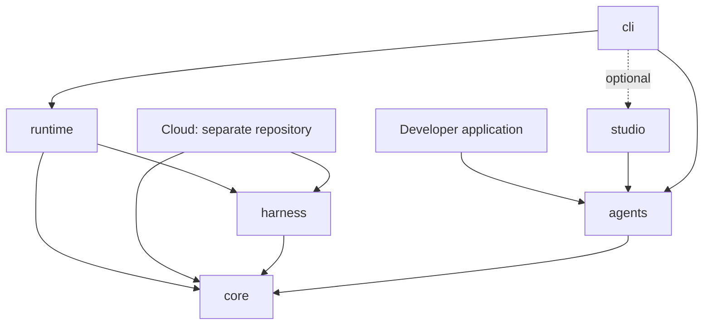
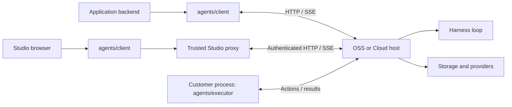

# Package architecture

Status: adopted for the clean beta package migration. Cloud migration is a separate operation.

## Intent

The SDK and both execution hosts share definitions and contracts without the SDK
installing the execution engine. OSS and Cloud implement the same host interface;
local development orchestration belongs to the CLI, not to either host.

Previously, harness combined authoring, contracts and execution, while runtime
combined the OSS host and the local launcher. The SDK therefore depended on
harness, and runtime depended on the SDK. The target separates these concerns.

| Package                 | Owns                                                                                   |
| ----------------------- | -------------------------------------------------------------------------------------- |
| `@nylorun/core`         | Definitions, manifests, canonical hashing, protocol schemas and shared interface types |
| `@nylorun/harness`      | Loop execution, checkpoints, execution planning and effects                            |
| `@nylorun/agents`       | Authoring facade, HTTP/SSE client and customer tool/hook executor                      |
| `@nylorun/runtime`      | OSS HTTP host, SQLite, scheduling, credentials and model providers                     |
| `@nylorun/cli`          | Configuration prompts, project loading, supervision, registration and local startup    |
| `@nylorun/studio`       | Dashboard and trusted local proxy                                                      |
| `@nylorun/create-agent` | Scaffolding and compatible dependency selection                                        |

## Package dependencies

Solid arrows mean package dependencies. Studio is optionally loaded by the CLI
from the developer project. External provider and UI dependencies are omitted.

Core has no Nylorun package dependencies. The SDK depends on neither host nor
engine. Neither host depends on the SDK. Engine internals never appear in core's
emitted declarations. Studio uses `agents/client`, not the executor.

## Process communication

The runtime advances the loop and issues actions. Customer code executes tools
and hooks after a scoped claim and returns outcomes. Runtime credentials remain
in Studio's trusted proxy, not its browser bundle. The CLI starts the local host
in a child process and connects local customer executors; Cloud deployment does
not need that launcher.

## Interfaces and ownership

- Core exposes `/define`, `/contracts`, and `/compatibility`; its root contains
  shared contracts and types. Definitions keep `Agent`, `tool`, schema validation
  and authoring semantics. Protocol/definition versions and manifest hashing
  belong to core.
- Built agents expose a non-enumerable `getBinding()` returning the manifest,
  ordered declarations, immutable executable tool snapshots, local implementations and live output schema. `toJSON()`
  remains manifest-only. Bindings contain local functions and are not a wire
  format. No shared WeakMap identity is required across installed package copies.
- Harness compiles bindings into private execution representations. `/run`,
  `/model/adapters`, and `/compatibility` remain execution entry points. Checkpoint
  compatibility and engine version remain harness responsibilities.
- Agents exposes `/define`, `/client`, and `/executor`, plus convenient root
  exports. The client owns discovery, sessions, commands and event streaming.
- Runtime exposes `/core`, `/node`, `/configuration`, and `/server`. The server
  export is an executable process entry point using the existing environment and
  readiness IPC contract. Reusable provider configuration remains in runtime;
  interactive prompting and project environment loading belong to CLI.
- CLI owns the `nylorun` binary with unchanged `configure`, `dev`, `start`, and
  `studio` commands. Studio remains optional. Generated applications install CLI
  as a production dependency because their `start` command uses it.

## Migration

This is a clean beta migration without deprecated authoring/protocol forwarding
exports from harness. SDK root authoring imports remain convenient.

| Previous usage                              | Replacement                                                                          |
| ------------------------------------------- | ------------------------------------------------------------------------------------ |
| `@nylorun/harness/define`                   | `@nylorun/agents/define` for applications; `@nylorun/core/define` for infrastructure |
| `@nylorun/harness/contracts`                | `@nylorun/core/contracts`                                                            |
| Harness manifest hash and protocol metadata | `@nylorun/core/compatibility`                                                        |
| Harness checkpoint compatibility            | `@nylorun/harness/compatibility`                                                     |
| Runtime-provided `nylorun` executable       | Install `@nylorun/cli`; commands are unchanged                                       |

Wire protocol, definition schema, canonical hashes and checkpoint representations
are unchanged. Packages remain independently versioned with exact tested internal
pins. Updating an SDK implementation requires consumers to receive that version
and rebuild/redeploy, even when their own code does not change.

## Alternatives

Keeping harness's existing subpaths avoids a package but couples SDK installation
and version updates to the engine. Separate definitions and protocol packages
offer independent releases but add compatibility combinations. One shared core
is the chosen compromise; it must not become a miscellaneous utilities package.

## Verification

Enforce dependencies in manifests, source, emitted declarations and loaded
modules. Test isolated packed SDK/core without harness and runtime without agents.
Exercise bindings from separate core copies, unchanged manifest hashes, live
schema transforms, hooks, middleware ordering, tool outcomes and checkpoint
continuation. Run fresh starter, headless, Studio, watcher, compiled start,
failure/shutdown and release-tooling checks with deterministic provider fixtures.
Studio's browser build must exclude executor, engine, host and Node-only modules.

## Cloud handoff

Cloud's existing vendored harness artifact is not changed or validated here.
Prepare matching versioned core and harness artifacts, update Cloud dependencies
to include core, and replace authoring/contracts/hash imports using the table
above. Retain harness execution imports. For offline packed validation, install
both artifacts explicitly so harness's exact core dependency resolves locally.

Before upgrading Cloud, run its build and tests and the same scenarios as OSS:
manifest/hash identity, text and customer-tool execution, hooks, session history,
event cursors, idempotent commands, scoped executor claims, cancellation, provider
errors and checkpoint recovery. Verify protocol/definition/checkpoint compatibility
against persisted data. Do not substitute a successful OSS smoke for Cloud
conformance. Publication and deployment are separate release operations.

## Source navigation

Authoring and wire schemas live under `core/src`; harness's `definition/` compiles
local bindings and owns the tool registry. `loop/` owns one run invocation,
`loop/step/` owns one model call, and `run/` exposes host execution. Harness's
remaining `types/` describes execution and checkpoint-facing client results.
Core supplies the shared authoring and adapter interfaces. Consult package export
maps before adding a public import; compiled engine representations stay private.
