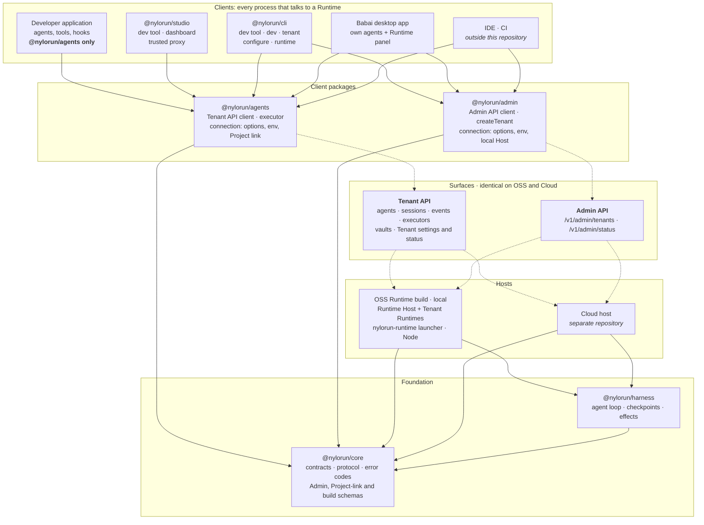
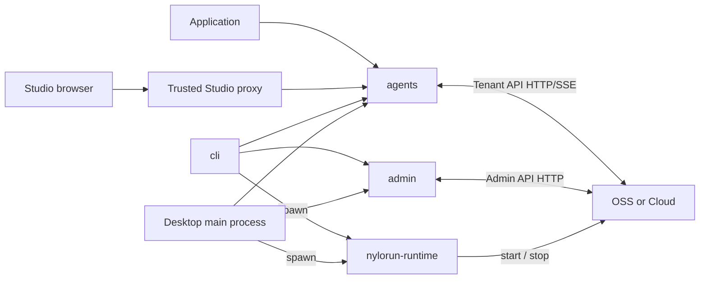

# Package architecture

Status: adopted for Runtime Clients and Admin API (version 1). Builds on the
clean beta package migration. Cloud migration remains a separate operation.

## Intent

Every process that talks to a Runtime is a **client**. Two client packages
cover the two surfaces OSS and Cloud share. A local OSS Runtime is installed
and started by a **launcher** inside a per-platform **Runtime build** — a
process, not a package dependency.

| Package | Owns |
| --- | --- |
| `@nylorun/core` | Definitions, manifests, protocol, error codes, Admin / Project-link / build-manifest schemas |
| `@nylorun/harness` | Loop execution, checkpoints, effects |
| `@nylorun/agents` | Tenant API client, authoring facade, executor, connection resolution |
| `@nylorun/admin` | Admin API client, safe Tenant creation, local Host connection |
| `@nylorun/runtime` | OSS Host + Tenant Runtimes; launcher source (not exported) |
| `@nylorun/cli` | Dev commands, Project links, bootstrap, running the application under a watcher |
| `@nylorun/studio` | Dashboard and trusted local proxy (`nylorun-studio`) |
| `@nylorun/create-agent` | Scaffolding and tested pins |
| `@nylorun/runtime-<platform>-<arch>` | Per-platform Runtime build (Node + runtime + launcher) |

## Packages, surfaces and hosts

Solid arrows are package dependencies. Dotted arrows mean "uses" or "is served
by". There are no arrows between clients. To use a local OSS Runtime, the CLI
and desktop apps also run the launcher inside its build. That is a process, not
a dependency.

`@nylorun/create-agent` generates a developer application and talks to no
Runtime, so it isn't shown.

## Dependency rules

- `core` has no Nylorun dependencies.
- **Client packages** (`agents`, `admin`) depend on `core` only and not on each
  other.
- **Clients** depend only on client packages. No client depends on another
  client, on `runtime` or on `harness`.
- **Hosts** depend on `harness` and `core`, never on a client package.
- **The launcher is part of the Runtime build.** Its source lives in
  `@nylorun/runtime`, which does not export it. Clients run it as a process.
- A developer application's production dependency tree contains
  `@nylorun/agents` and `@nylorun/core` and no other Nylorun package.

## Process communication

## Interfaces and ownership

- **core** — `/define`, `/contracts`, `/compatibility`; Admin, Project-link and
  build-manifest schemas; closed `ERROR_CODES`; id generators.
- **agents** — `/define`, `/client`, `/executor`; `resolveConnection`,
  application and executor modes of `connectAgents`, derived executor tokens.
- **admin** — `createAdmin`, `createTenant`, Tenant list/get/delete, `status`.
- **runtime** — `/core`, `/node`, `/server` (Host entry). Launcher compiles to
  `dist/launcher/main.js` and ships only inside Runtime builds.
- **cli** — `nylorun` binary: `dev`, `runtime`, `tenant`, `configure`, `doctor`.
  No `@nylorun/runtime` dependency; no `serve` or `studio` commands.
- **studio** — `nylorun-studio` binary and `startStudio()`; depends on `agents`
  only among Nylorun packages.

## Migration

See [MIGRATION.md](../../MIGRATION.md#runtime-clients-and-admin-api-breaking-beta)
for the four application upgrade steps. Wire protocol and Tenant layout from
Runtime Tenants are unchanged; this release adds client packages, builds and
the launcher.

## Cloud boundary

This repository must not know Cloud. After OSS packages publish to npm, Cloud
upgrades by installing those packages in its own repository. The Admin API and
Tenant API contracts are identical on both hosts.

## Source navigation

Authoring and wire schemas live under `core/src`. Client packages live under
`agents/` and `admin/`. Host and launcher source live under `runtime/src`
(`host/`, `tenant/`, `launcher/`). Consult package export maps before adding a
public import; the launcher is not exported.
